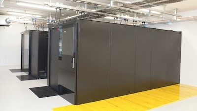

# Using the Arnes Computing Cluster

In the High Performance Computing course, we will be able to use the [Arnes](https://www.sling.si/en/arnes-hpc-cluster/) computing cluster for our work. Currently, it is the second most powerful supercomputer in Slovenia ([the first is Vega](https://en-vegadocs.vega.izum.si/general-spec/)).
|  | 
|:--:| 
| *Arnes Computing Cluster*|

### Specifications
- 4944 processor cores
  - 62 x 64 cores, [AMD Epyc 7702P](https://www.amd.com/en/products/cpu/amd-epyc-7702p)
  - 24 x 12 cores, [AMD Epyc 7272](https://www.amd.com/en/products/cpu/amd-epyc-7272), 2x [Nvidia V100](https://www.nvidia.com/en-us/data-center/v100/)
  - 7 x 32 cores, [AMD Epyc 9124](https://www.amd.com/en/products/processors/server/epyc/4th-generation-9004-and-8004-series/amd-epyc-9124.html), 2x [Nvidia H100](https://www.nvidia.com/en-us/data-center/h100/)
  - 3 x 24 cores, [AMD EPYC 9254](https://www.amd.com/en/products/processors/server/epyc/4th-generation-9004-and-8004-series/amd-epyc-9254.html), 4x [Nvidia H100](https://www.nvidia.com/en-us/data-center/h100/)
- Software
  - OS [AlmaLinux 9](https://almalinux.org/)
  - Distributed file system [Ceph](https://ceph.io/en/)
  - Job management system [SLURM](https://slurm.schedmd.com/)

We will access the system via an SSH connection. User accounts and passwords for access can be found on [the FRI course page](https://ucilnica.fri.uni-lj.si/mod/assign/view.php?id=31722). Access is only possible using a SSH key and 2FA authentication. First, generate your SSH key and add it to the [Sling Identity Management System](https://fido.sling.si/). Instructions on how to create your own key and add it to the identity management system can be found [here](https://doc.sling.si/workshops/supercomputing-essentials/02-slurm/06-ssh-key/). Next, configure set up and configure a 2FA app on your smartphone. Instructions can be found [here](https://www.sling.si/dvostopenjska-avtentikacija-za-dostop-do-arnesove-racunske-gruce/). After setting up everything needed, you connect to the cluster via command line using:

```ssh <username>@hpc-login.arnes.si```

## Environment Setup

When working with the cluster, you can use any remote access tool (command shell, MobaXterm, Putty, FileZilla, WinSCP, Termius, ...). However, we recommend using [VSCode](https://code.visualstudio.com/) in combination with the [Remote - SSH](https://code.visualstudio.com/docs/remote/ssh) extension. Instructions on how to set up the connection via VSCode can be found [here](https://doc.sling.si/navodila/vscode/). When setting up, use the Arnes login node `hpc-login.arnes.si`!

When using VSCode, there can be issues with 2FA authentication. VSCode asks you to input the OTP code twice, be aware that you need to input **two different** codes for the authentication to be successful.

We recommend using krb5 tokens as described in the [instructions](https://www.sling.si/dvostopenjska-avtentikacija-za-dostop-do-arnesove-racunske-gruce/). The token is valid for 24 hours, after thet you need to generate it again. It allows you to log into the cluster without OTP. This method works on Linux and Mac. 

Windows users can generate tokens in the [WSL environment](https://learn.microsoft.com/en-us/windows/wsl/install) and instruct VSCode to use the ssh client within the WSL environment for connection. To do this, create a script file `ssh.bat` with the content:
```
wsl --exec ssh %*
``` 
Then, in the VSCode environment, change the `Remote.SSH: Path` setting to contain the absolute path to your `ssh.bat` file. Your private key and configuration file `config`, which are usually located in the folder `C:\Users\<username>\.ssh\`, must be transferred to the `~/.ssh` folder in the WSL environment. You must also fix the access permissions for your private key:
```
chmod 600 ~/.ssh/<private_key_file>
```

## Running Jobs on the Cluster

A guide for working on the cluster and using the middleware [SLURM](https://slurm.schedmd.com/) for job and task management can be found [here](https://doc.sling.si/workshops/supercomputing-essentials/01-intro/01-course/). I recommend all course participants to go through the course published at the previous link. For our work with the cluster, we will use the `fri` reservation, so we won't have problems with waiting for our jobs to execute. In the reservation, we have access to several compute nodes that other cluster users cannot occupy. Use the reservation when running a job in the following way:

```$ srun --reservation=fri <program_name>```

You can also run jobs using a bash script in which you specify job requirements. Example script:
```Bash
#!/bin/bash
#SBATCH --job-name=my_job_name
#SBATCH --partition=all
#SBATCH --reservation=fri
#SBATCH --ntasks=4
#SBATCH --nodes=1
#SBATCH --mem-per-cpu=100MB
#SBATCH --output=my_job.out
#SBATCH --time=00:01:00

srun hostname
```
Save the above script to a file with extension `.sh`, e.g.: `job.sh` and run it with the command:
```
$ sbatch job.sh
```

## Assignment
*Does not count as one of the four assignments in the course!*
1. Change your default user password on [https://fido.sling.si/](https://fido.sling.si/).
2. Create and add an SSH key to your user profile on [https://fido.sling.si/](https://fido.sling.si/). Instructions can be found on [this link](https://doc.sling.si/workshops/supercomputing-essentials/02-slurm/06-ssh-key/).
3. Set up authentication 2FA authetication according to [these instructions](https://www.sling.si/dvostopenjska-avtentikacija-za-dostop-do-arnesove-racunske-gruce/).
4. Connect via SSH to the Arnes login node: `hpc-login.arnes.si`.
5. Run the `hostname` program on a compute node within the `fri` reservation.
6. Run the `nvidia-smi` program (displays information about graphics processing units on the node). When running it, you must use the appropriate partition with compute nodes that contain GPUs (`--partition=gpu`).
7. For those interested in learning more, you can complete the [Supercomputing Essentials](https://doc.sling.si/workshops/supercomputing-essentials/01-intro/01-course/) workshop.
