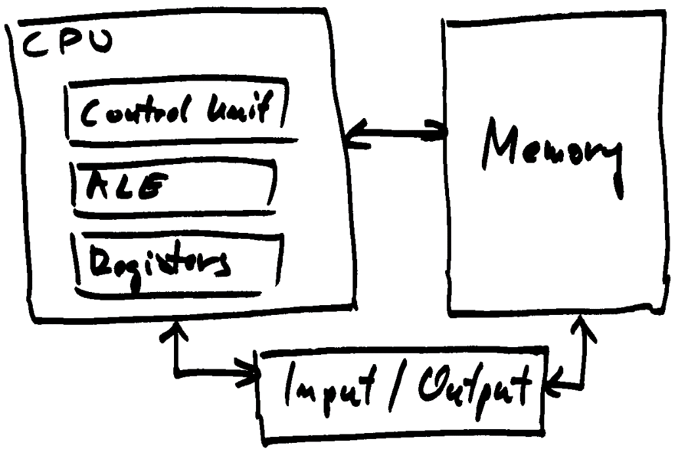
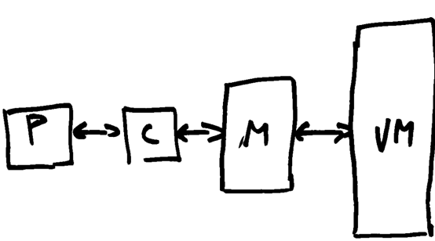

# Computer Systems Architectures

## von Neumannova architecture and improvements

- central processing unit or processor, memory, I/O devices

  

- operation: fetch instruction, decode, fetch operands, execute, store
- sequential execution of instructions
- memory bottleneck
- improvements:
  - memory hierarchy
  - hardware parallelism

### Memory hierarchy



- a processor with registers (P), cache (C), main memory (M), and virtual memory (VM)
- access to main memory is two orders of magnitude slower than access to registers (latency and bandwidth)
- multi‑level cache
  - organized into cache lines (commonly 64B)
  - entire cache block is transferred
  - if data is missing, the processor still waits
  - exploiting spatial and temporal locality
  - cache hits and misses
    - example: accessing a matrix
  - where to copy data from main memory
    - delete the oldest cache line
    - associative: all locations are equivalent
    - set‑associative: a subset of available locations
    - direct: exact mapping
  - ensuring memory coherence is important
    - write‑through: when writing to cache, data is also written to main memory
    - write‑back: dirty bit is set in cache line when writing, when cache line is about to be overwritten, it’s content is first written to the main memory
  - multi-level cache system (L1, L2, L3)
- virtual memory
  - extension of main memory
  - significantly slower than main memory, even greater need for data locality
  - page swapping and page faults
  - rapid virtual to physical memory address mapping
    - TLB (Translation Lookaside Buffer)
      - specialized cache for address translation (up to 128 entries on 1st level)
      - TLB miss
        - access to a page not in TLB, walking over the whole page table to find translation
        - Example: stencil @ large 3D array: row, column, page access
        - Element by element walk, number of pages can be large
        - High TLB miss rate when accessing neighboring elements even when number of page faults is low
        - If the 3D array is big, a high page fault rate may also result  

### Hardware parallelism

- pipelining
  - functional units are arranged into stages
  - stages should be as equally complex as possible
  - example: summation of two floating point numbers
    - 1.23e4 + 6.54e3
    - loading, exponent comparison, exponent alignment, summation, normalization, rounding, storing
    - number of cycles for 1 and 1000 summations
- vector instructions
  - explicit parallel usage of multiple functional units on a small amount of data
  - special instructions
- parallel functional units
  - exploit parallelism within a single instruction stream
  - example: two units, one is working on odd and one on even iterations of a for loop
- very large instruction word (VLIW)
  - at a compile time many independent operations are grouped together
  - instruction words 64 – 1024 bits
- superscalar execution
  - parallel execution of independent instructions
  - allocation of functional units is dynamic, at runtime (for non-superscalar processors is static, at compile time)
  - example: parallel arithmetic units with dynamic allocation
  - example: speculative execution
    - during conditional execution, instructions that follow can already be executed
  
    ```C
    if (x > 0) {
      z = x + y;
      w = x;
    }
    else {
      w = y;
    }
    ```

    - `if (x > 0)` and assignment `z = x + y` are performed in parallel
- hardware multithreading
  - no need to search for parallelism in sequential thread (in many cases does not exist)
  - simultaneous multithreading (instructions from multiple threads are fed to superscalar scheduler  dynamically, at runtime
  - switch-on event multithreading
    - latency hiding
    - when one thread stops due to memory or IO access, another can be processed
    - rapid switching of threads at the long-latency operations

## Serial illusion

- developments in hardware have led to long-sustained serial illusion
- serial traps: serial assumptions incorporated in tools and thinking
  
  ```C
  void addme(int n, double a[n], double b[n], double c[n]) {
    for (int i = 0; i < n; i++)
      a[i] = b[i] + c[i];
  }

  double a[10]
  addme(9, a+1, a, a);  // pointer arithmetic causing aliasing
  ```
  
- compilers are not reliable at discovering parallelism (loops, memory access via pointers in C)
