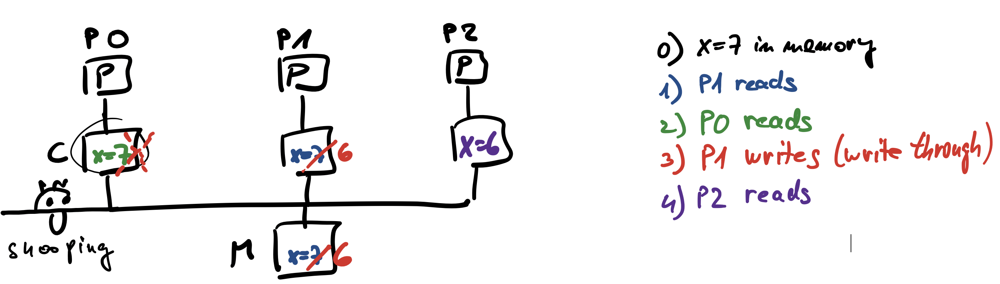

# Shared-memory Systems

## Architecture

- multiple instructions, multiple data

- share a common memory

  - processors/cores operate independently
  - processors can access each other's memory
  - changes in memory by one processor are visible to the others

- UMA vs NUMA

  - complexity and scalability
  - memory access times
  - cache coherence and false sharing may be magnified with NUMA
  - UMA = SMP (Symmetric Multi-Processors)
  
  

- memory access

  - memory is divided into many modules evenly distributed among processors
  - each core has its own cache
  - data
    - private: used only by a single processor
    - shared:
      - used by multiple processors
      - used for inter-process communication

- check the architecture of a node in the Arnes cluster

  ```bash
  module load likwid
  srun --reservation=fri --exclusive likwid-topology -g
  ```

### Cache Coherence

- different processors must see the same value at a given memory address

- snooping:
  - cache memory controller monitors the bus to identify which cache lines are written by other processors
  - write invalidate protocol (most common)
  - get exclusive access before writing data (write-through)
  - before writing, all other copies of this data are invalidated
  - does not scale well
  - illustration

    

- directory-based protocols
  - better suited for NUMA
  - a single directory contains sharing information (statuses) about every cache line
  - to keep performance, it is distributed among the computer’s local memories
  - must keep track of which processors have copies to invalidate them when needed
  - example: simplified protocol
    - statuses
      - U: uncached, not in any cache
      - S: shared by one or more processors, values in memory are correct
      - E: exclusive, one processor has written the cache line, values in memory are obsolete
    - illustration

      

### False Sharing

- cache is implemented in hardware, and it operates on cache lines
- even if processors do not operate on the same variable but on variables located in the same cache line, cache coherence protocols are involved
- does not produce false results
- has disastrous consequences on performance
- illustration

  

## Programming: Processes and Threads

### Processes

- when we start a program, a new process appears in the operating system
- a process is the basic unit to which the operating system allocates resources:
  - a share of CPU cycles
  - a portion of free memory, which the OS protects from access by other processes
  - access to communication ports and I/O devices
  - file handles for the files the program needs
- the process first runs code that handles the tasks above, and then it runs the ```main()``` function in the program
- memory Allocation
  - program code and dynamic libraries
  - global variables defined outside the ```main()``` function
  - the heap is used for dynamic memory allocation
  - the stack stores everything needed during a function call, as well as variables defined inside a function

  

## Threads

- a thread is the basic execution unit that can be executed by the OS
- a process can include several internal execution units, or threads
- a process always has at least a master thread
- from the master thread, we can start additional threads
  - this creates a new sequential flow of execution that runs asynchronously with the main one
  - the master flow of execution continues
  - from that point on, the master thread and the additional thread are equivalent
  - if needed, we can join the additional thread back to the master thread

  

- thread execution
  - threads are executed by the operating system; we have no control over the order in which they run
  - a multithreaded program can run on a single CPU core
  - if threads execute independent flows of execution on multiple cores at the same time, we call this parallel processing

- software vs. hardware threads
  - hardware threads allow multiple separate flows of execution to run simultaneously
  - the operating system decides which hardware thread will execute a particular software thread

## Multithreaded processes

  

- shared resources
  - global variables (shown as static variables in the diagram)
  - the program code
  - dynamically allocated memory (the heap)
  - access to files, ports, and I/O devices
  - context switching
  - a process time slice

- threads execute independent flows of execution, so each one has its own:
  - registers, such as the program counter and stack pointer
  - stack
    - local variables on the stack are private to each thread
    - if a thread shares a memory address with other threads, those threads can access its local memory

- context switching

  - time slices

    

  - process
    - core state information includes:
      - registers, stack pointer, program counter
      - segmentation tables, page tables
      - to avoid incorrect address translation when the previous and current processes using different memory, the translation lookaside buffer (TLB) must be flushed
    - this involves a lot of operations which negatively affect performance
  
  - inside a process
    - user space implementation, no interaction with the kernel
    - locally saving thread registers
    - easier to tailor the scheduling policy

- a thread lifecycle:
  - when program starts only the main thread (master thread) is active
  - where a parallel operation is required, master thread creates additional threads
  - threads work concurrently
  - at the end of a parallel operation, additional threads are suspended, and only the master thread continues

    
