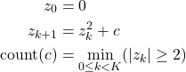

# OpenMP

- Open MultiProcessing, [https://www.openmp.org/](https://www.openmp.org/resources/tutorials-articles/)
- API for shared-memory parallel programming
- usage
  - compiler directives ```#pragma omp ...```
  - functions
  - environment variables
- compiling

  ```C
  #include "omp.h"
  
  gcc … -fopenmp ...

  srun --cpus-per-task=N
  ```

- Main OpenMP elements
  - library functions
    - ```omp_get_thread_num```, ```omp_get_num_threads```
  - environmental variables
  - distribution of work
    - directives ```parallel```, ```parallel sections```, ```parallel for```
    - ```scheduling``` clause
  - synchronization
    - directives ```critical```, ```atomic```, ```barrier```, ```single```, ```master```
  - scope of variables
    - clauses ```shared```, ```private```, ```reduction```

## Some Library Functions

- number of threads
  - ```omp_set_num_threads```: sets number of threads to be used in parallel section
  - ```omp_get_num_threads```: get currently set number of threads
  - ```omp_get_max_threads```: get max. number of threads (on hardware level)
  - ```omp_get_thread_num```: get thread index 0 … omp_get_num_threads
- number of processors/cores
  - ```omp_num_procs```: number of processors available
- timing
  - ```omp_get_wtime```: wall-clock time elapsed from some point in the past
  - ```omp_get_wtick```: resolution of wall-clock time measurement

## Environmental Variables

- user can influence the behavior of executable code at runtime
- set number of threads

  ```C
  export OMP_NUM_THREADS=4
  unset OMP_NUM_THREADS
  ```

## Distribution of Work

- directive ```parallel```
  - source [hello1.c](files/hello/hello1.c)
  - check the printouts
  
- clauses ```sections```, ```section```, and ```nowait```
  - source [hello2.c](files/hello/hello2.c)
  - barrier is automatically set after eachsections directive
  - to disable it add ```nowait``` clause

- ```parallel for```
  - most frequently used OpenMP functionality
  - distributes iterations among threads
  - for statement must be given in canonical shape

    ```C  
                                    ++i
                                    i++
                                    --i
                         i <        i--
    for (int i = iStart; i <= iEnd; idx += iStep      ) 
                         i >=       idx -= iStep
                         i >        idx = idx + iStep
                                    idx = idx - iStep
    ```

- ```parallel for collapse (num)```
  - parallelization of ```num``` nested loops

- ```parallel for schedule(type, number)```
  - useful when workload significantly differs from iteration to iteration
  - ```type```
    - static: iterations are mapped to threads at compile time, default
    - dynamic: when thread finishes its work, it gets new number of iterations to compute
    - guided: each threads gets larger portion of iteration at the beginning, then the number is reduced
    - runtime: set though environment variables
  - ```number```: the smallest chunk of iterations assigned to a thread

- example: The Mandelbrot set

  - an image of The Mandelbrot set from [Wikipedia](https://en.wikipedia.org/wiki/Mandelbrot_set)

      

  - the Mandelbrot set (black) is the set of all points $c$ in the complex plane where the value converges with iterations
    - algorithm

      

    - Divergence for large $z$
    - Compute the function up to some maximum value $K$

  - serial control flow in elemental functions

  - load imbalance

  - implementation
    - as opposed to vector operations like saxpy, it cannot be efficiently computed on SIMD systems
    - best with SPMD or tiled SIMD

  - [mb0.c](files/mb/mb0.c): manual parallelization
  - [mb1.c](files/mb/mb1.c): parallelization of outermost loop using the parallel for
  - [mb2.c](files/mb/mb2.c); parallelization of both loops
  - [mb2.c](files/mb/mb3.c); dynamic scheduling improves performance
  
## Synchronization

- dependencies between tasks require synchronization
- overhead
  - launching and synchronizing tasks
  - over-decomposition increases overhead

### Race conditions

- concurrent tasks perform read and write operations at the same memory location
- are tricky, should be avoided
- example

  ```C
  Task A      Task B
  X = 1;      Y = 1;
  a = Y;      b = X;
  ```

  - initial values: ```X = 0, Y = 0```
  - possible outcomes:
    - ```a = 1, b = 0```
    - ```a = 0, b = 1```
    - ```a = 1, b = 1```

- critical section: only one thread enters critical section at once
- directives ```critical``` and ```atomic```
  - prevent race condition

  - hardware implementation
    - modern processors do not lock memory bus, but works on cache line
    - works together with the MESI cache coherence mechanism
    - instructions with LOCK prefix
      - synchronize the cache-line with the main memory
      - acquire exclusive access to the cache line and mark it locked
      - perform read-modify-write on operands in the cache line
      - mark the cache line modified and unlocks it
    - while the cache line is locked, the cache coherence requests of other CPUs are ignored

  - performance of directives
    - ```critical``` uses locks and performs operation in 3 steps:
      - lock (atomically sets a variable),
      - arbitrary number of instructions,
      - unlock
    - ```atomic``` combines all together – instruction takes care of locking and modifying a variable atomically
      - applicable only to scalar variable assignment with operators ++, --, +=, -=, *=, /=, &=, |=, <<=, >>=
      - faster than critical

- example:
  - computing $\pi$ following Lebnitz formula

    

  - [pil0.c](files/pil/pil0.c): does not compile as for loop is not in canonical form
  - [pil1.c](files/pil/pil1.c): loop dependence, race condition
  - [pil2.c](files/pil/pil2.c): correct result, poor performance
  

