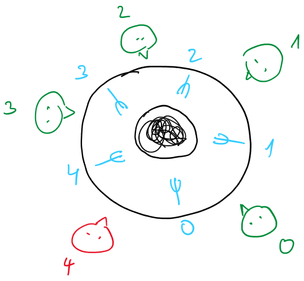
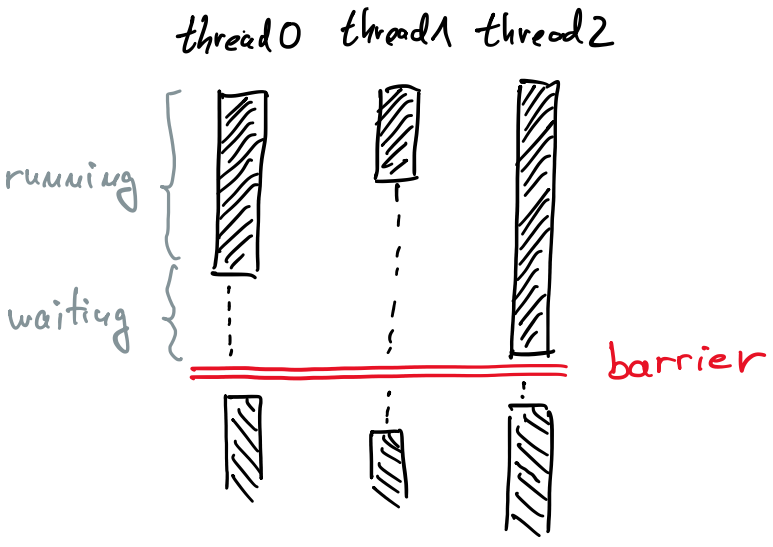

# Synchronization

- dependencies between tasks require synchronization
- overhead
  - launching and synchronizing tasks
  - over-decomposition increases overhead

## Race condition

- concurrent tasks perform read and write operations at the same memory location
- are tricky, should be avoided
- example

  ```C
  Task A      Task B
  X = 1;      Y = 1;
  a = Y;      b = X;
  ```

  - initial values: ```X = 0, Y = 0```
  - possible outcomes:
    - ```a = 1, b = 0```
    - ```a = 0, b = 1```
    - ```a = 1, b = 1```

## Critical section

- critical section is the block of code where race condition can occur
- it implies a memory fence of all thread-visible variables
- allowing only one thread at once entering the critical section prevents race condition
- hardware must assure to keep other threads away from the critical memory location
- directives ```critical``` and ```atomic```

  - hardware implementation
    - modern processors do not lock memory bus, but works on cache line
    - works together with the MESI cache coherence mechanism
    - instructions with LOCK prefix
      - synchronize the cache-line with the main memory
      - acquire exclusive access to the cache line and mark it locked
      - perform read-modify-write on operands in the cache line
      - mark the cache line modified and unlocks it
    - while the cache line is locked, the cache coherence requests of other CPUs are ignored

  - performance of directives
    - ```critical``` performs operation in 3 steps:
      - lock (atomically sets a variable),
      - arbitrary number of instructions,
      - unlock
    - ```atomic``` combines all together – instruction takes care of locking and modifying a variable atomically
      - applicable only to scalar variable assignment with operators ++, --, +=, -=, *=, /=, &=, |=, <<=, >>=
      - faster than critical

- locks
  - very common synonym is mutex (eng. MUTual EXclusion)
  - combination of hardware and software OS (mechanism)
    - first attempt using CPU instructions (e.g. LOCK)
    - if it is necessary to wait, OS takes control of locking
  - with locks we can guarantee that only one thread accesses a variable at a time
  - ordinary and nested locks
  - using locks in OpenMP
    - declare the lock variable: ```omp_lock_t``` or ```omp_nest_lock_t```
    - initialize the lock: ```omp_init_lock```,
    - at the beginning of the critical section set the lock or test for locked: ```omp_set_lock```, ```omp_test_lock```
      - test checks whether the lock is available: if available, sets the lock, if not, returns without waiting
    - destroy the lock: ```omp_destroy_lock```

- example: $\pi$ following the Leibnitz formula

  - [pil2.c](files/4-pil/pil2.c): wrong result - race condition
  - [pil3.c](files/4-pil/pil3.c): correct result but poor performance
  - [pil4.c](files/4-pil/pil4.c): correct result and even worse performance
  - [pil5.c](files/4-pil/pil5.c): correct result using locks (the slowest)

### Deadlock

- example: Dining Philosophers Problem (Dijsktra)

  

  - five philosophers, plates of spaghetti and five forks
  - philosophers have a discussion: they think and talk, become hungry, eat, think and talk, ...
  - during the discussion they eat many dishes
  - each philosopher eats with two forks, he can only take a fork of his neighbor
  
  - [phil0.c](files/5-phil/phil0.c): infrastructure set up, they do not take care of limiting number of resources
    - each philosopher is a thread
    - forks are limiting resources, could be presented as threads
  - [phil1.c](files/5-phil/phil1.c): deadlock - each philosopher has one fork, waiting for another
  - [phil2.c](files/5-phil/phil2.c): another lock which allows only one philosopher at once to take forks from the table, limiting performance

- deadlock occurs only if four Coffman's conditions are met
  - resources (critical sections) have a limited number of owners (threads)
  - an owner can acquire resources sequentially, one by one
  - an owner has the exclusive right to release a resource
  - there is a circular dependency between the owners — the first waits for the second, the second for the third, …, and the last one waits for the first again

- How to prevent a dead-lock?
  - if owner cannot get next lock he should release already taken locks
    - [phil3.c](files/5-phil/phil3.c): if one cannot get the second fork, put the first fork back on a table for a while
  - order the locks and always require locks in the defined order
    - [phil4.c](files/5-phil/phil4.c): the best solution
  - the second approach is preferred, use the first one only if the second if not feasible

### Critical Sections and Performance

- locking is slow, avoid it whenever possible
- example: $\pi$ following the Leibnitz formula
  - [pil6.c](files/6-pil/pil6.c): local variable reduces locking to once per thread
    - directives ```parallel``` and ```for``` are split to allow declaration of the local variable
  - [pil7.c](files/6-pil/pil7.c): sequential summation in the main thread, no more locking
    - allocation of memory - size of the array equals number of threads in parallel section
    - directives ```master``` and ```single``` request that only one thread works on designated section of the parallel code
  - [pil8.c](files/6-pil/pil8.c): OpenMP has special directive for the reduction operation
    - the idea is the same as in previous example, the ```reduce``` clause hides dirty details from a programmer

## Synchronization barrier

- an important synchronization element
- a barrier is a synchronization point where multiple threads must all stop and wait until every one of them reaches it
- only when all participating threads arrive at the barrier can they all continue execution

  

- barriers are used when different threads perform work in phases, and the next phase cannot begin until all threads have finished the current one
- OpenMP construct ```#pragma omp barrier```
- example: [Conway's Game of Life](https://en.wikipedia.org/wiki/Conway%27s_Game_of_Life)
  - a cellular automaton
    - entirely deterministic
    - simple rules produce complex, emergent behavior
    - patterns can be static, oscillating, or moving (e.g., gliders)
    - it’s Turing complete, capable of universal computation
  - the world is a grid of cells, each either dead or alive
  - time progresses in discrete steps or generations
  - each cell’s next state depends only on its 8 neighbors
    - underpopulation: a live cell with fewer than 2 live neighbors dies
    - survival: a live cell with 2 or 3 live neighbors stays alive
    - overpopulation: a live cell with more than 3 live neighbors dies
    - reproduction: a dead cell with exactly 3 live neighbors becomes alive
  
  - [cgl1.c](files/7-cgl/cgl1.c): a basic solution
    - two worlds ```world``` and ```worldNew``` are arrays, for each new iteration we only update pointers to both arrays
    - helper functions in [cgl.h](files/7-cgl/cgl.h)
    - as the world evolves in discrete steps, we cannot parallelize the while loop
    - parallel section in each generation to parallelize the computation of new cells' states
      - expensive as we have to create threads in each loop
  - [cgl2.c](files/7-cgl/cgl2.c): improved solution
    - directives ```parallel``` and ```for``` are split, parallel section is created only once
    - we need two barriers
      - all threads must finish computing the new states before updating the world
      - only one thread (```master```) must update the world and increase the generation counter
      - all threads must wait that the master thread updates the world before starting with a new generations

## Other synchronization elements

- Flush
  - cores share the main memory but have their own caches
    - cache coherence (NUMA)
    - when a thread updates shared data, the new value will first be stored back to the local cache
    - the updates are not necessarily immediately visible to other threads
  - the flush directive makes thread’s temporary view of shared data consistent with the value in the main memory
    - thread-visible variables are written back to memory

## Scope of Variables

- threads share global variables
- threads do not share
  - variables declared in parallel sections
  - variables of functions called from parallel sections
- the scope of variable can be redeclared by clauses
  - ```shared```: default, no need to specify
  - ```private```: creates copies of global variable which are local for each thread
  - ```firstprivate```: like private, but also initializes local variables with current value of global variable
  - ```lastprivate```: when leaving parallel section it sets global variable to a value equal to the local variable of the thread which handled the last iteration
  - ```threadprivate```: values of local variables are kept in memory when parallel section is finished; useful when parallel sections are recreated
  - ```reduce```: a combination of global and local variables created by a compiler

- example: $\pi$ following the Leibnitz formula
  - [pil8.c](files/6-pil/pil8.c): reduction operation simplifies coding
  - [pil7.c](files/6-pil/pil7.c): reduction without the ```reduce``` clause shows details needed to perform the reduction

- example: two for loops with iteration variables ```i``` and ```j``` globally declared
  - [vars0.c](files/8-vars/vars0.c): not all printouts are displayed
  - [vars1.c](files/8-vars/vars1.c): all printouts appear as we requested variable ```j``` to be private for each thread
  - [vars2.c](files/8-vars/vars2.c): locally declared variables make code easier to read
