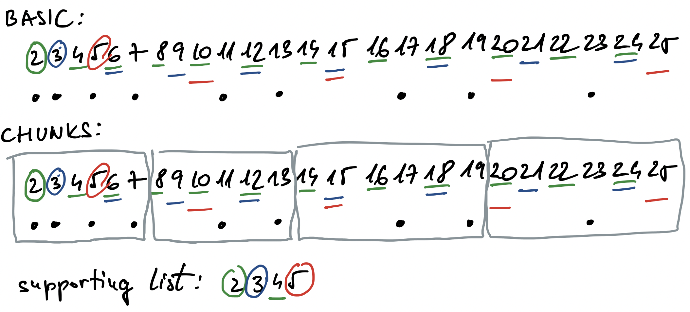

# Performance Issues

## Thread creation

- minimize the number of entries into the parallel section
- each time when code goes from sequential to parallel, threads must be created which takes time
- see the Conway's game of life example
- avoid parallel overhead when number of iterations is low

  ```C
  #pragma omp parallel for if (iters > 100)
  for(i = 0; i < iters; i++) {
    ...
  }
  ```

## Critical sections

- reduce the number of critical sections
- the code in a critical section should be as short as possible so that the time a thread spends in it is as short as possible

## False sharing

- avoid false sharing
- cache is implemented in hardware, and it operates on cache lines
- even if processors do not operate on the same variable but on variables located in the same cache line, cache coherence protocols are involved
- illustration
  - [fs.c](files/9-fs/fs.c), [fs.sh](files/9-fs/fs.sh)
    - cache line is usually 64 bytes long
    - when two threads in parallel write to variables in the same cache line, performance is slow due to coherence mechanism
    - when two threads are modifying variables in separate cache lines, code runs much faster

## Cache

- always think about how your data is laid out in memory
- exploit temporal and spatial locality
- avoid unnecessary cache evictions
- example: the Sieve of Erathostenes
  - find primes in an interval $[1, n]$
  - find first prime $k$
  - repeat until $k \leq \sqrt{n}$
    - mark all multiplies of a prime
    - find next prime
  - count all primes

  

  - basic solution: walks through whole array when marking multiples
  - chunks
    - a portion of the array, the size should be chosen to fit in cache
    - supporting array is necessary for each chunk as we must always start marking with prime 2
    - process the chunks one after another to keep data in cache until all non-primes are marked (cache-fusion approach)
  - parallel
    - the same idea as with chunks, but threads can do the job in parallel
  - [soe_ser.c](files/10-soe/soe_ser.c) - serial version of the code
  - [soe_par.c](files/10-soe/soe_par.c) - parallel version, each thread is working on its part of the array, each thread has a supporting array starting with 2
  - [soe_parchunk.c](files/10-soe/soe_parchunk.c) - parallel version where each thread processes its portion of the array in chunks
  - chunks bring much more to the performance then parallelization
