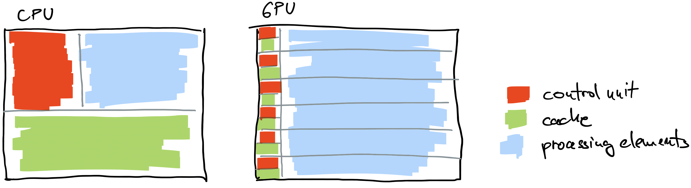
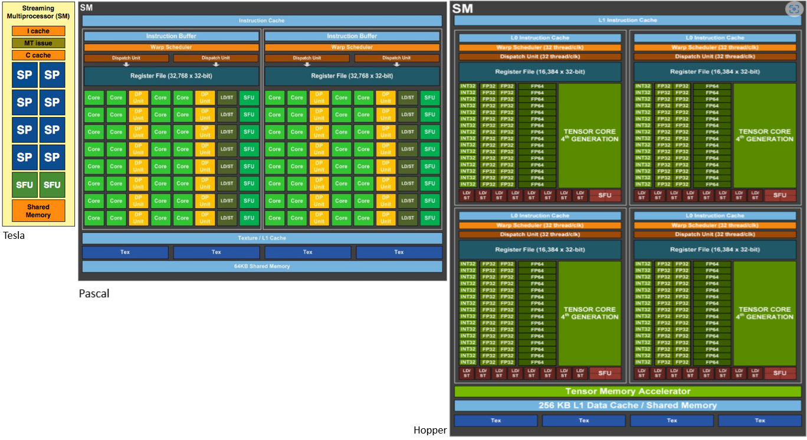
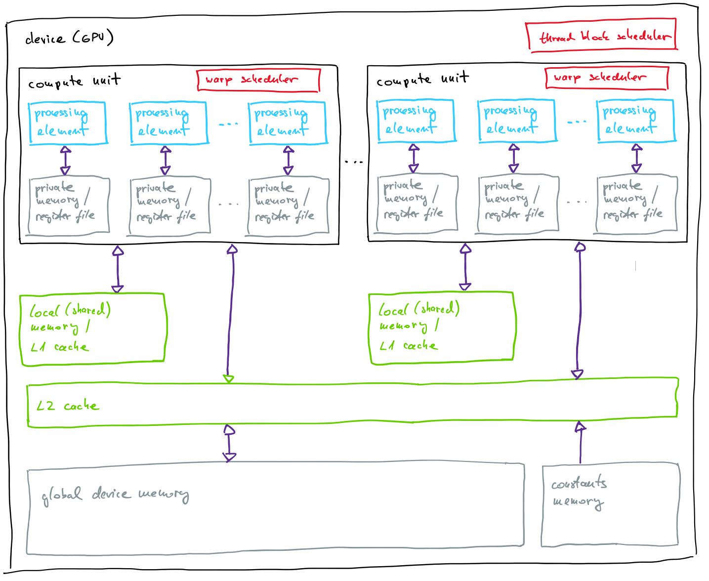
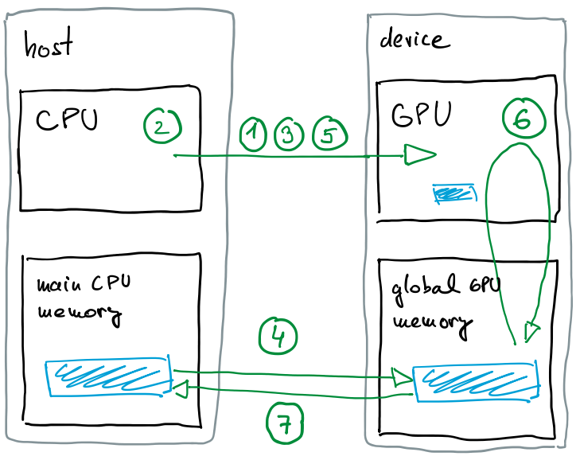

# Graphics Processing Units

## Introduction

- the computer game industry at the turn of the millennium drove the development of extremely powerful graphics processing units
- graphics processing units (GPUs) or graphics accelerators
  - have their own processors and memory
  - primarily intended for image rendering
  - perform graphics tasks faster than central processing units (CPUs)
  - 2D acceleration:
    - operations: bit-blit (block image transfer, no flickering when moving objects), line drawing, coloring, clipping invisible parts of the image, …
    - pixel shaders
  - 3D acceleration:
    - operations: geometric transformations (rotations, perspective), hidden surfaces, coloring, lighting, textures, shading, image generation …
    - vertex shaders
  - initially, separate chips for 2D and 3D acceleration
    - many applications do not need both parts simultaneously
    - more general circuits capable of both
      - Nvidia CUDA architecture – Compute Unified Device Architecture
      - Nvidia GeForce 8800 GTX is the first device with CUDA architecture
- at the beginning of the millennium, the first attempts appeared to use GPUs for solving problems not directly related to computer graphics
  - general-purpose computing on GPUs (GPGPU)
  - initially, only graphics APIs were available (Direct3D, OpenGL)
    - converting general operations into graphics operations on pixels, vertices, triangles
    - algorithms became unnecessarily complex and hard to read
- GPU manufacturers later supported floating-point operations and others
- GPU programming became similar to CPU programming
- programming interfaces:
  - CUDA (Nvidia)
    - limited to Nvidia GPUs
    - no need for hardware configuration
  - OpenCL (Khronos Group)
    - very general, supports GPUs, FPGA circuits, and DSP chips
    - portability comes at a cost – each program includes a lot of initialization and system checking code
  - many others
- programming model:
  - quite different from CPU programming
  - code must largely be rewritten
  - we create an unlimited number of threads
  - the thread scheduler dynamically assigns them to hardware

## Architecture

### GPU vs CPU

- CPU
  - complex control unit (instruction flow analysis)
  - large cache
  - optimized for execution of serial code
  - better than GPUs for problems with frequent control flow divergence: branching, recursion, graph operations
- GPU
  - highly powerful computational devices
  - emphasis on parallelism (separate computation of pixels)
  - many simple arithmetic logic units (ALUs) at the expense of control units and cache
  - latency hiding for memory access
  - excellent for highly parallel problems: data-parallel streams, matrix operations

  

### Hierarchical processor design

- compute unit
  - also multiprocessor – MP, SIMD engine
  - similar to a CPU core
  - has its own instruction set
  - built from many processing elements and other computational/control units
- processing element
  - also streaming processor – SP, core, ALU
  - similar role to ALU in CPU
  - SIMD concept (single instruction multiple data)
- other computational units
  - special function units
  - specialized units for integer and single/double precision computations
  - tensor cores
- control unit
  - controls multiple processing elements
  - instruction fetch and decode
  - no advanced control flow analysis
  - hides memory latency via scheduling many threads
  - assigns threads to processing elements (warp scheduler)
  - load/store units handle operand transfer



*Source: documentation from [Nvidia](https://www.nvidia.com/) web pages*

### Hierarchical memory design

- compute unit
  - private memory
    - also register file, registers
    - 32-bit registers
    - divided among processing elements
    - each thread gets its share
    - compiler used registers for local variables
    - if registers run out, part of global memory is used!
    - access time: 1 cycle
  - L1 cache and shared memory
    - ratio configurable
    - threads exchange data via shared memory
    - access time: 1–32 cycles
- device
  - L2 cache
    - shared among all compute units
    - managed by hardware
  - global memory
    - store data
    - all data exchange with host (CPU) goes through global memory
    - readable and writable by compute units
    - divided into 128-byte segments, entire segment is always transferred to a compute unit
    - access time: ~500 cycles
  - constant memory
    - host can write to it
    - read-only for compute units
     access time: ~500 cycles



## Heterogeneous system

- a node, in addition to CPU cores, contains one or more accelerators
- CPU and GPU are often named host and device, respectively
- offloading model
- device is usually connected via a high-speed bus
  - programs consist of two parts:
    - sequential code on the host:
      - device detection (1)
      - data transfer to device (2)
      - compilation (3) and transfer of program kernels (4)
      - trigger kernel execution (5)
      - transfer of results back to host (7)
  - parallel code on the device:
    - program kernel execution (6)
    - executed by every thread 
- asynchronous execution:
  - host continues execution after launching a kernel
  - kernel execution can overlap with data transfers



## Execution model

- emphasis on data parallelism
- the idea is to create a large number of threads to hide memory latency - utterly different from CPUs where caches and out-of-order execution are used for latency hiding
- hierarchical thread organization:
  - follows hierarchical architecture of processors and memory - thread grid, block, warp
  - thread grid
    - composed of thread blocks
    - all threads in a grid execute the same code (kernel)
  - thread block
    - block scheduler assigns them to compute units
    - all threads from the block run on the same compute unit
    - multiple thread blocks can run simultaneously independently of other blocks
    - block execution order is undefined - in worst case they can be executed serially - one by one 
    - thread block is executing as long as all threads do not finish 
    - threads can share data via shared memory
    - thread in a block can synchronization via shared memory
  - thread warp
    - smaller group of threads with consecutive IDs (32 threads in Nvidia GPUs)
    - basic execution unit which can be scheduled
    - all threads in warp execute the same instruction
      - follows SIMT (single instruction multiple threads) paradigm
      - each thread has its own program counter and private registers, which allows them to execute independently (divergence)
      - efficient when all threads execute the same instruction
      - in case of divergence the execution is serialized until all threads reach the same instruction again
    - warp scheduling
      - if one warp stalls compute unit can send another warp from any thread block assigned to the compute unit to execution
      - no switching overhead
        - resources (memory, registers) are equally divided among threads executing in the same compute unit
        - state of each threads in a warp is kept private, so there is no need to store the state before switching

- global memory access:
  - global memory is divided into 128-byte segments
  - if threads in a warp access different data in the same memory segment, the data is transferred in only one memory transaction
  - if the segment contains data not requested by any thread, they are transferred anyway, which reflects in lower throughput
  - if two threads from the same warp access two different memory segments, two transactions are needed

- limitations
  - max threads per block: 1024
  - max threads per compute unit: 2048
  - max blocks per compute unit: 32
  - warp size: 32
  - max warps per compute unit: 64
  - max registers per thread: 255
  - shared memory per compute unit: 48–228 KB
  - shared memory per block: 48 KB
  
- device properties
  - querying a device state

  ```bash
  srun --partition=gpu --gpus=1 nvidia-smi --query
  ```

  - detail information about a device: [devinfo.c](files/devinfo.c)
  
  - example of an output

    ```C
    ======= Device 0: "Tesla V100S-PCIE-32GB" =======

      CUDA Architecture:                                      Volta, 7.0

      GPU clock rate (MHz):                                   1597
      Memory clock rate (MHz):                                1107
      Memory bus width (bits):                                4096
      Peak memory bandwidth (GB/s):                           1134

      Number of compute units:                                80
      Number of processing elements per compute unit:         64
      Total number of processing elemets:                     5120

      Total amount of global memory (GB):                     32
      Size of L2 cache (MB):                                  6
      Total amount of local memory per compute unit (kB):     96
      Total amount of local memory per thread block (kB):     48
      Maximum number of registers per compute unit:           65536
      Maximum number of registers available per thread block: 65536

      Maximum number of threads per compute unit:             2048
      Maximum number of threads per thread block:             1024
      Maximum number of blocks per compute unit:              32
      Thread warp size:                                       32

      Maximum size of a thread block (x,y,z):                 (1024, 1024, 64)
      Maximum size of a thread grid (x,y,z):                  (2147483647, 65535, 65535)
    ```
