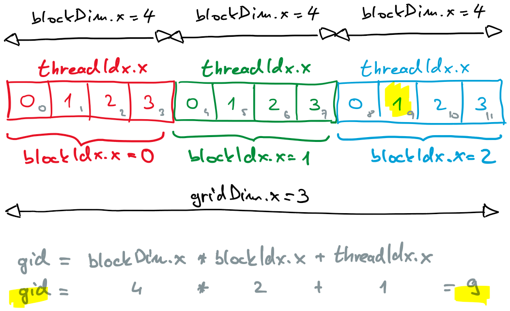

# CUDA Programming Interface

- a CUDA kernel represents code that runs on a GPU
- the kernel is written as a sequential program
- the programming interface handles the compilation and transfer of the kernel to the device
- the kernel executes individually on its own data for each thread

## Hierarchical Organization of Threads

- a grid of threads
  - all threads in the grid execute the same kernel
  - threads in the grid share global memory on the GPU
  - the grid consists of thread blocks

- a thread block
  - all threads in a block are executed on the same compute unit
  - they can exchange and synchronize through local (shared) memory

- a thread warp
  - group of consecutive threads that follows SIMT (single instruction multiple threads principle)
  - 32 threads at Nvidia GPUs and 64 at AMD GPUs
  
- a thread
  - executes the kernel sequentially on its own data
  - uses its private memory
  - shares the local memory with other threads in the block
  - can access global memory and constant memory

## Thread Indexing

- 1D, 2D, or 3D indexing
- threads are grouped in thread warps first by dimension x, then y, and finally z
- the number of dimensions is chosen based on the nature of the problem
- CUDA C supports a set of variables reflecting thread organization:
  - ```threadIdx.x```, ```threadIdx.y```, ```threadIdx.z```
  - ```blockIdx.x```, ```blockIdx.y```, ```blockIdx.z```
  - ```blockDim.x```, ```blockDim.y```, ```blockDim.z```
  - ```gridDim.x```, ```gridDim.y```, ```gridDim.z```
- thread indexing
  
  

## GPU Kernel

- a GPU kernel is code that is started from the host but runs on the device
- the kernel is written as a function, prefixed by the keyword ```__global__```
- the kernel does not return a value
- a kernel example:

  ```C
  __global__ void greetings(void) {
    printf("Hello from thread %d.%d!\n", blockIdx.x, threadIdx.x);
  }
  ```

- the kernel is launched on the host, where triple angle brackets are inserted between the name and arguments
- thread organization in the grid - the number of blocks and the number of threads in each dimension - is specified within the triple angle brackets
- for describing multidimensional thread organization, the CUDA C language provides the ```dim3``` structure:

  ```C
  dim3 gridSize(numBlocks, 1, 1);
  dim3 blockSize(numThreads, 1, 1);
  greetings<<<gridSize, blockSize>>>();
  ```

- a kernel can also call other device functions marked with the ```__device__``` keyword
- to emphasize that a function runs only on the host, it is marked with ```__host__```

## The first GPU program

- [hello-gpu.cu](files/hello-gpu.cu)
- load the module: ```module load CUDA```
- compile the code with the CUDA C compiler: ```nvcc -o hello-gpu hello-gpu.cu```
- run the program: ```srun --partition=gpu --gpus=1 ./hello-gpu 2 4```


## Memory Allocation and Data Transfer

- the host has access only to the global memory of the device

### Explicit Data Transfer

- on the host, memory is allocated using the ```malloc``` function
- global memory on the device is allocated using the function call:

  ```C
  cudaError_t cudaMalloc(void** dPtr, size_t count)
  ````

- this function allocates ```count``` bytes and returns the address in the device's global memory to the pointer ```dPtr```
- to transfer data between the device’s global memory and the host memory, we use the function:

  ```C
  cudaError_t cudaMemcpy(void* dst, const void* src, size_t count, cudaMemcpyKind kind)
  ```

- this function copies ```count``` bytes from the address ```src``` to the address ```dst``` in the direction specified by kind, which is
  - for transferring data from host to device ```cudaMemcpyHostToDevice```, and
  - for transferring data from device to host ```cudaMemcpyDeviceToHost```
- the function is blocking - the program execution continues only after the data transfer is complete

- device memory is freed with the function call:

  ```C
  cudaError_t cudaFree(void *devPtr)
  ```

- memory on the host is freed using function ```free```

### Unified Memory

- newer versions of CUDA support unified memory
- CUDA performs data transfers as needed
- a programmer has no control, and it is often less efficient than explicit transfers
- the unified memory is allocated using the function call:

  ```C
  cudaError_t cudaMallocManaged(void **hdPtr, size_t count);
  ```

- the unified memory is freed using the function call:

  ```C
  cudaError_t cudaFree(void *hdPtr)
  ```

- in our examples we will not work with the unified memory

## Example: SAXPY

- Single precision A times X Plus Y
- vectors **x** and **y**
- element-wise operation ```y[i] = a * x[i] + y[i]```
- the map pattern
- solutions
  - [saxpy0.cu](files/saxpy0.cu): support for one thread block
  - [saxpy1.cu](files/saxpy1.cu): added support for multiple thread blocks, the number of blocks is calculated based on the problem size
  - [saxpy2.cu](files/saxpy2.cu): improved code, threads with global index out of the vector (array) bounds don't do any work
  - [saxpy3.cu](files/saxpy3.cu): in case when total number of threads is smaller than the problem size, some threads do additional work
  - [saxpy4.cu](files/saxpy4.cu): unified memory
