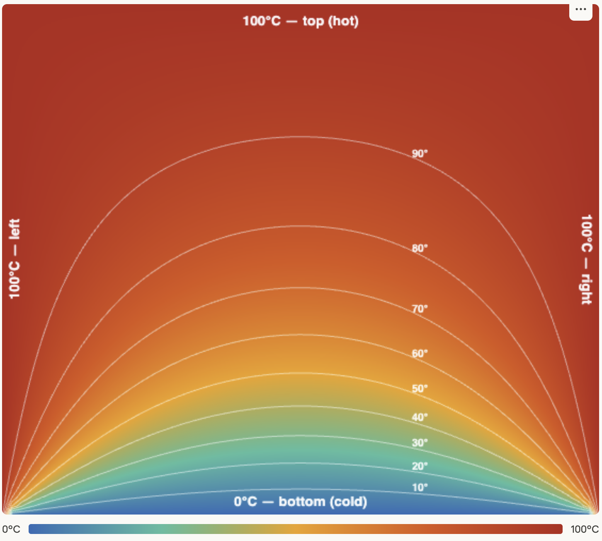

# Patterns with CUDA Programming

## Stencil

- zpecial case of map
  - 1D or multiple dimensions
- has regular data access pattern
  - each output depends on a neighborhood of inputs
  - inputs have fixed offsets relative to the output
  - can be implemented as
    - set of random reads for each output
    - shifts
- applications
  - image and signal processing (convolution)
  - physics, mechanical engineering, CFD (PDE solvers over regular grids)
  - cellular automata
- different neighborhoods
  - square compact, ..., sparse
  - cache optimizations
  - stencils reuse samples required for neighboring elements
- boundaries of grids given to a processor
  - exchange data with other processors
  - additional communication costs

### Implementation with Shift Operation

- beneficial for 1D stencils
- allow vectorization of data reads
- does not reduce memory traffic

### Implementation with tiles

- multidimensional stencils
- strip-mining (optimized for cache)
- example
  - two-dimensional array organized in row-by-row fashion
  - horizontal data in the same cache line, vertical far away
  - horizontal split
    - whole line does not fit cache, a lot of cache misses when accessing adjacent rows
  - vertical split
    - processors redundantly read the same cache line
  - strips (vertical)
    - each processor gets its strip of width equal to a multiple of cache line size
    - processing goes sequentially from top to bottom to maximize cache reuse
    - multiple of cache line size prevents false sharing between adjacent strips on output

### Communication

- commonly the output of stencil is used as the input for the next iteration
  - double buffering
  - pointers to buffers are interchanged between iterations
- need for synchronization
- boundary regions (halo) of the grid may need explicit communication with neighboring processors
  - halo can be exchanged each iteration
  - data exchange can take place on each $k$-th iteration when halo radius is increased, and some redundant computation takes place on each processor
  - latency hiding (update of internal grid cells when waiting for halo exchange)

### Example: Heat distribution

- square surface, three edges touch boiling water, one edge is put in ice
- How is the heat distributed inside the surface?
- Laplace equation

  $\frac{\partial^2 T(x,y)}{\partial x^2} + \frac{\partial^2 T(x,y)}{\partial y^2} = 0$
  
- discretized Laplace equation is in proper form for iterative solving

  $T(x, y) = \frac{1}{4} \cdot (T(x-h, y) + T(x+h, y) + T(x, y-h) + T(x, y+h))$

- surface size $N+2$ includes boundary values on the edges
- result

  

- solutions
  - [heat0.cu](files/1-stencil/heat0.cu): CPU reference code
  - [heat1.cu](files/1-stencil/heat1.cu): GPU code, reading directly from the global memory
  - [heat2.cu](files/1-stencil/heat2.cu): GPU code, using local memory, static allocation
    - first threads copy data to the local memory
      - local memory is organized as a 2D tile which includes halo needed by threads on edges to correctly compute the next iteration
      - each thread transfers the value for which it is responsible
      - threads on edges also transfer values from halo (cells)
    - threads can start with computation only when all data is in local memory
      - ```__syncthreads()``` represents a barrier in CUDA C
  - [heat3.cu](files/1-stencil/heat3.cu): GPU code, using local memory, dynamic allocation
  - [heat4.cu](files/1-stencil/heat4.cu): GPU code, using local memory, dynamic allocations
    - threads in a warp ar not accessing neighboring memory locations
    - degraded performance

## Reduce

- a collective operation
- reduce pattern allows data to be combined
  - combiner function $f(a, b) = a \oplus b$
  - pairwise operation
  - associativity must hold
    - $(a \oplus b) \oplus c = $a \oplus (b \oplus c)$
    - operands can be combined in any order
    - floating point addition and multiplication are only partially associative due to the limited precision
  - commutativity
    - $a \oplus b = b \oplus a$
    - not required, but enables additional reorderings
  - identity
    - initial value of reduction

### Tiling

- use serial algorithm where possible
- do tree-like reduction to reduce communication costs
- process
  - break the work to tiles
  - operate on tiles separately
  - combine partial results from tiles
- serial and tree algorithms
  - the number of combiner function applications is the same
  - serial algorithm requires less storage for intermediate results

### Theoretical Considerations

- sequential reduction of $N$ operands
  - $N−1$ reductions
  - each invocation of reduce function needs $\chi$ to complete
  - total execution time is $t_s = \chi (N-1)$
- parallel tree-like reduction, $n=2^k, k\in \mathbb{N}$
  - establishing communication takes $\lambda$ units of time 
  - $N/2$ reductions in the first stage can go in parallel, $N/4$ in the second stage can go in parallel ... $1$ reduction in the last stage
  - altogether we have $\log_2 N$ stages with total $N-1$ reductions
  - total execution time equals $t_p = (\chi+\lambda)\log_2 N$

### Fusing Map and Reduce

- when map is feeding outputs directly into a reduction, the combination can be implemented more efficiently
- no need for synchronization between map and reduce stages
- no need to write intermediate results to memory or file
- map and reduce must be tiled in a same way

### Example: Dot Product

- vectors $\mathbf{a}$ and $\mathbf{b}$ of length $N$
- dot product

  $$\mathbf{a}\cdot \mathbf{b} = \sum_{i=0}^{N-1} a_i \cdot b_i $$

- solutions
  - [dotprod0.cu](files/2-reduce/dotprod0.cu): CPU reference code


- one thread, sequential
- problem size and number of threads
- shared memory
- summation on host
- tree-like
  - sum neighbours: stride is increasing with iterations
  - warp-optimized solution: stride is decreasing with iterations
- generalization for non-power-of-two block sizes
