# Dense Matrix Multiplication with CUDA

## Memory Allocation

- two representations: row-major and column-major

  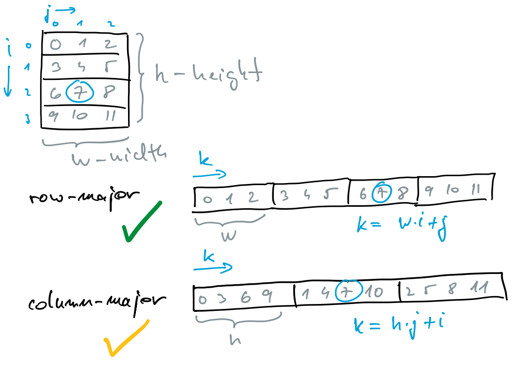

- number of matrix elements ```h``` $\times$ ```w```
- 1D indexing
- 2D indexing

  - non-contiguous approach
    - allocate array of pointers to the beginning of rows
    - allocate array of row elements separately for each row
    - access to elements: ```m[row][col]```
    - there is no guarantee that rows will be adjacent to each other in memory!å

    ```C
    float **m = (float **)malloc(h * sizeof(float *));
    for (int i = 0; i < h; i++)
      m[i] = (float *)malloc(w * sizeof(float));
    ...
    for (int i = 0; i < h; i++)
      free(m[i]);
    free (m);
    ```

    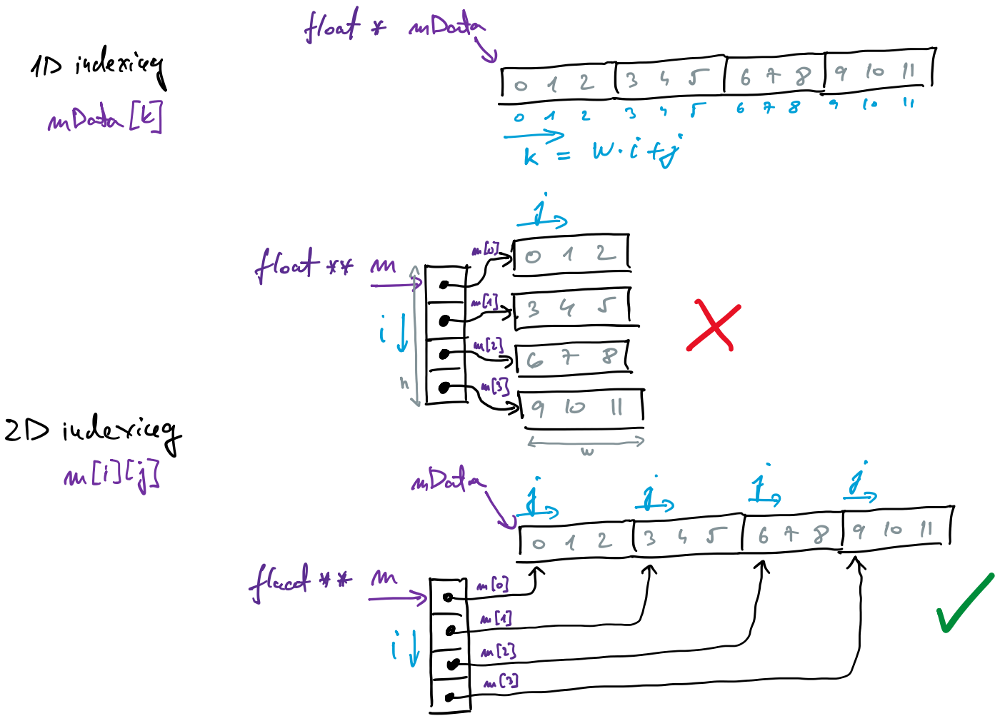

  - contiguous memory approach
    - allocate an array of matrix elements (```mData```)
    - allocate array of pointers to beginning of h (```m```)
    - access to elements: ```m[row][col]```
    - whole matrix data is stored in continuous memory space
    - a matrix can be easily transferred to a GPU or another compute node

    ```C
    float *mData = (float *)malloc(h * w * sizeof(float));
    float **m = (float **)malloc(h * sizeof(float *));
    for (int i = 0; i < h; i++)
      m[i] = &mData[i * w];
    ...
    free (m);
    free (mData);
    ```

## Multiplication with GPU

### Straightforward approach

- each thread computes one scalar product of the resulting matrix (blue)
- global indexing of threads

  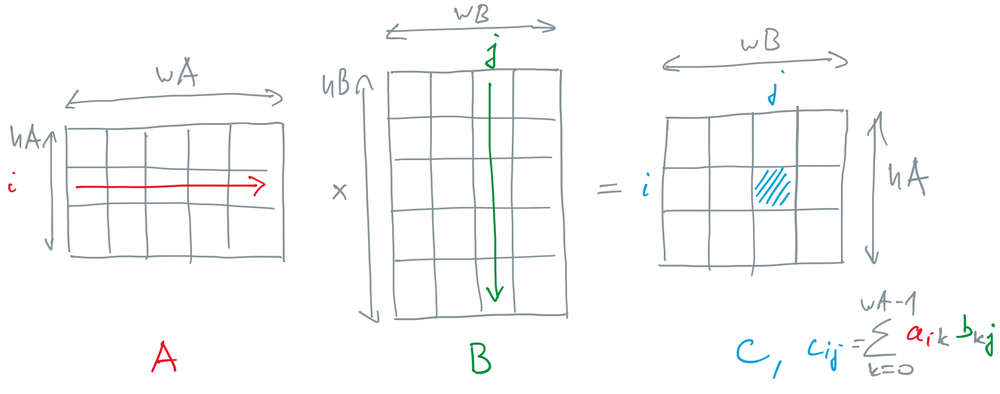

- [mm0.cu](files/mm0.cu): straightforward approach

### Tiled approach

- each thread computes one element of output vector, same as above
- matrices are split to sub-matrices (tiles)
  - multiplication of sub-matrices follows the same pattern as multiplication of scalar elements
  - instead of scalars we are multiplying sub-matrices
- two phase approach
  - phase 1
    - coalesced reading of tiles (sub-matrices) from input matrices ```A``` and ```B```
    - all threads in a block simultaneously copy data from global to local memory
    - proper indexing of threads assures that whole warp is reads data from global memory in one transaction
  - phase 2
    - each thread calculates a dot product on a tile
    - matrix elements are read from local memory
    - partial scalar products are kept thread-wise
  - when all scalar product on a tile are completed, process continues with next tiles of matrices ```A``` and ```B```
- implementation
  
  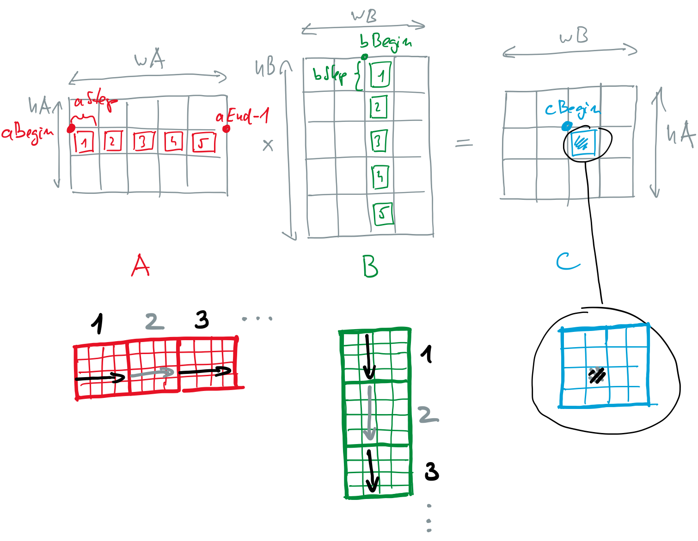

- solutions
  - [mm1.cu](files/mm1.cu): tiled approach
  - [mm2.cu](files/mm2.cu): tiled approach with improper indexing of threads

## Matrix Multiplication in Deep Models

### Neural Networks

- general-purpose mathematical models
- a lot of free parameters
- different learning algorithms
- libraries
  - building blocks
  - modelling, learning, inference

  

  Source: [medium.com](https://medium.com/analytics-vidhya/not-torturing-in-learning-pytorch-b2f7f169923a)

- multilayered perceptron

  - fully connected model
  - inference at one layer
    - input values are multiplied by the synaptic weights
    - a sum of values on all synapses
    - activation function gives output

    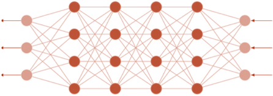

  - mathematical formulation:
    - product of the input vector (matrix) and the weight matrix gives the output vector (matrix)

    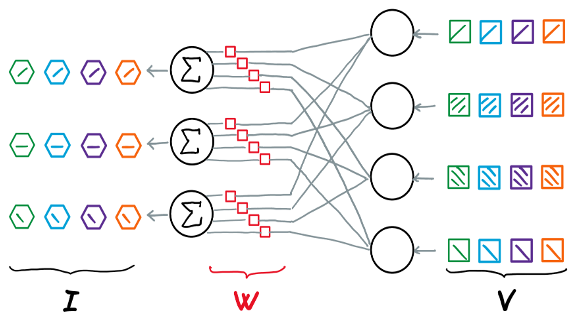

- convolution neural network
  - YOLO-v4 tiny backbone
  - image processing
  - many convolution layers
  - inference

    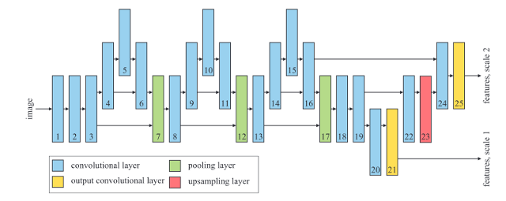

  - mathematical formulation at one layer
    - convolution of filters and image
    - tensors
    - by unfolding filter and image  data in a proper way, convolution becomes matrix multiplication

    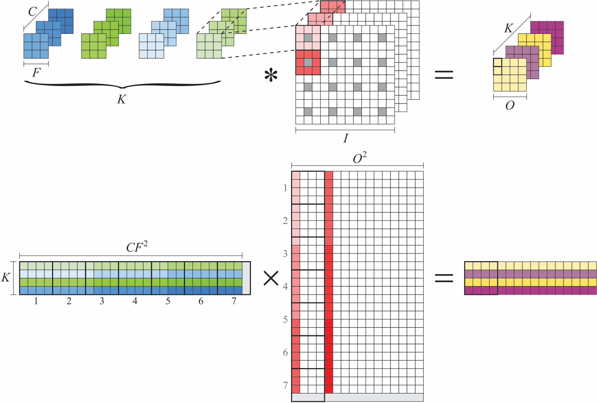

- neural network training
  - presenting the neural network with a set of pairs (inputs, correct outputs)
    - inference + weight adaptation
    - weight adaptation follows gradient descent algorithms
    - gradients can also be calculated using matrix operation
    - model error decreases
  - large language models use similar ideas
  - for fast computation, we must try keeping model parameters (and data) in graphics accelerators' memory

### Tensor Cores: Matrix Operations in Hardware

- FMA operation
  - fused multiply and add, $d = c + a\times b$
  - multiplier
  - output from the multiplier goes to the adder input
  - an accumulator to store intermediate result
  - one operation in each clock cycle

    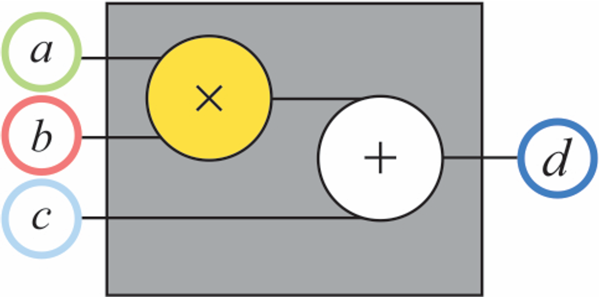

- FMA and matrices
  - general matrix multiplication unit or a GEMM unit, $\mathbf{D} = \mathbf{C} + \mathbf{A} \times \mathbf{B}$

    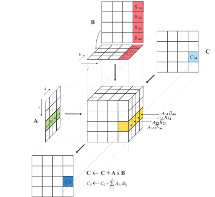

  - we can do $4\times 4$ or more matrix multiplications in one clock cycle
    - multipliers and adders are decision circuits
    - we can combine them into a GEMM unit for one element of a $4\times 4$ matrix

    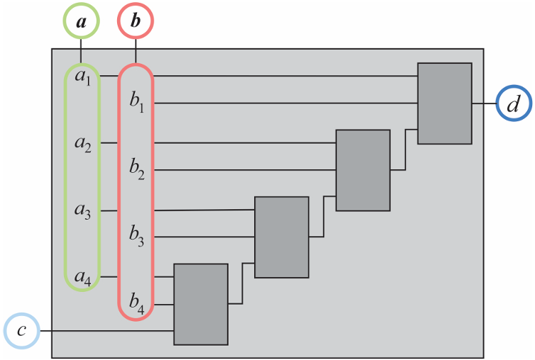

    - combining 16 such units gives us a circuit with $64 = 16 \times 4$ multipliers, capable of GEMM operation in one clock cycle!
  - benefit: transferring fewer operands compared to the same number of scalar products with a vector unit
  - commercial names: TPU, tensor core, neural processing unit, neural engine, matrix core

### Precision: how low can we go

- neural networks are resilient on errors in computation
- can use less precise number representations
- benefits of using shorter number representations
  - smaller FNA circuits
  - transfer of more operands from memory
  - computation on more operands at the same time
- floating-point number formats
  - double precision: ```double``` (FP64)
  - single precision: ```float``` (FP32)
  - tensor float: ```tf32```
  - half-precision: ```half``` (FP16)), ```bf16```
  - quarter precision: ```fp8```
  - FP6, FP4, ...

  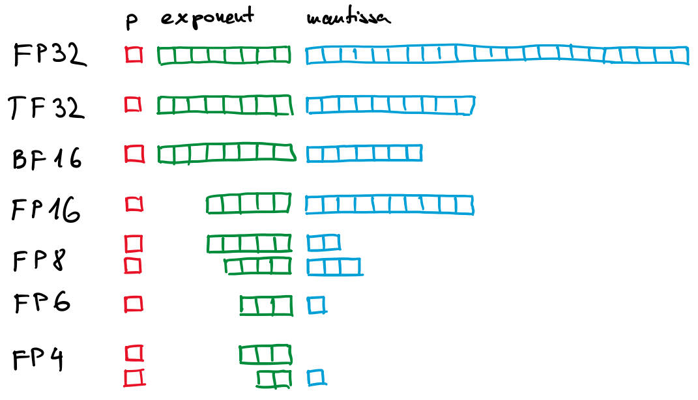

- solutions
  - [mmhp.cu](files/mmhp.cu): tiled approach using half precision
  - [mmtc.cu](files/mmtc.cu): tiled approach using tensor cores
    - WMMA API (warp matrix multiply accumulate, a C++ library)
    - Nvidia V100 supports tensor core multiplication of tiles $16\times 16$, $32\times 8$, $8\times 32$ with inner dimension (dot product) of $16$ elements
    - in parallel we compute tiles of size $32\times 32$ in the resulting matrix
    - in the solution 1D block of 128 threads contains 4 warps, which we arrange in $2\times 2$ grid of $16\times 16$ subtiles
    - computation follows the same idea as before, a bit more complex with additional split to subtiles
    - whole warp must work on multiplication of $16\times 16$ subtiles
      - tensor cores work with fragments - registers structures for storing matrices
      - each thread in a warp holds a private slice of a fragment, all 32 threads must work together
      - we can only work with fragments through WMMA API
    - as inner dimension supported by tensor cores is $16$, we declare rectangular tiles of sizes $32\times 16$ and $16\times 32$
