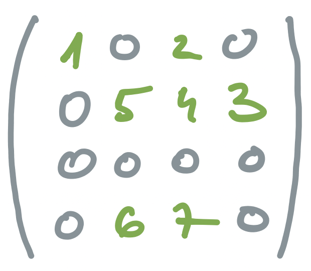
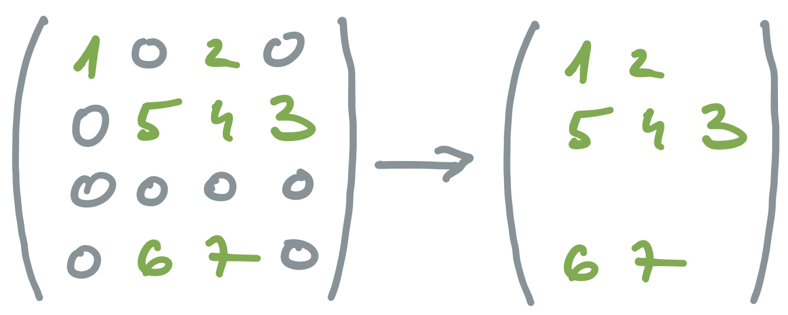
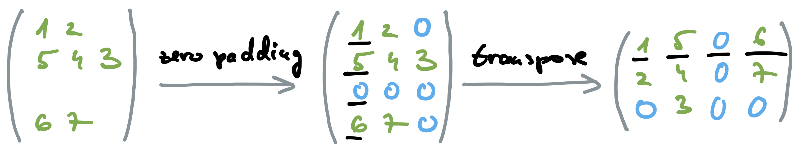
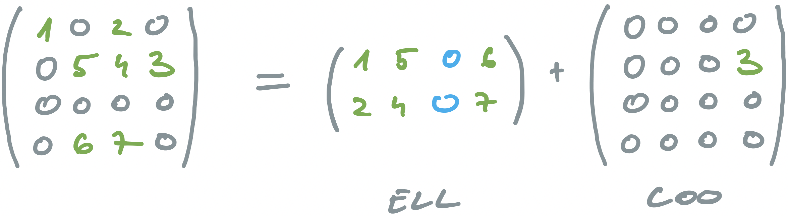
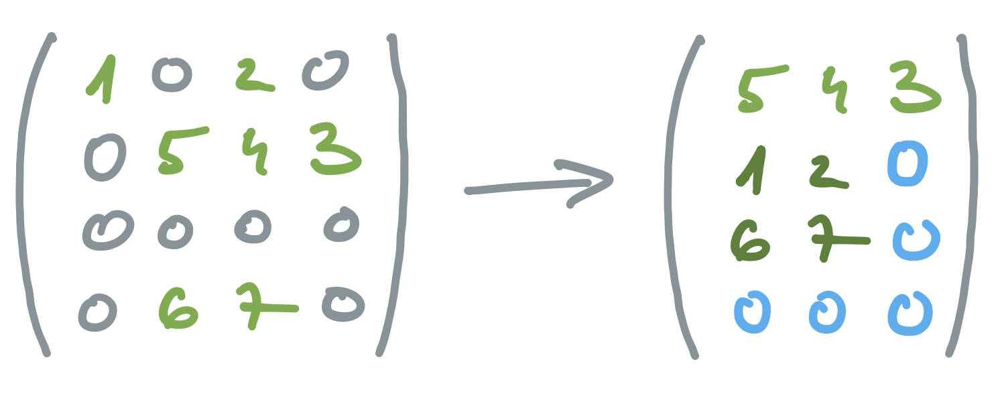

# Sparse Matrix Multiplication with CUDA

## Sparse Matrices

- matrices with majority of elements having value zero
- usage: science, engineering, financial modelling
- many real-world applications work on sparse matrices
- only non-zero elements are important
- compaction of representation
  - storing in a format which avoids storing zeros
  - introduces irregularity
- irregularity is a drawback in parallel implementations
  - under-utilization of memory bandwidth
  - control flow divergence
  - load imbalance
  - illustrates data-dependant performance common to real-world applications
- storage formats
  - quest for good balance between compaction and regularization
  - good compaction, high level of irregularity
  - modest compaction, more regular representation

## Sparse Matrix-Vector multiplication (SpVM)

- very common in real world applications
  - scientific computing
    - finite element analysis (structural engineering, fluid dynamics)
    - climate/weather simulation
  - machine learning
    - training sparse neural networks
    - recommendation systems
  - graph analysis
    - PageRank and web search ranking
    - social network analysis
  - linear solvers
    - iterative solvers of systems of equations like conjugate gradient

- operation: $mathbf{v}_{out} = \mathbf{M} \times \mathbf{v}_{in}$

## Representations

### Coordinate representation (COO)

- also known as matrix market format
- each non-zero element is represented with
  - data,
  - row, and
  - column information

  

  ```C
  data[7] = (1, 2, 5, 4, 3, 6, 7)
  row[7]  = (0, 0, 1, 1, 1, 3, 3)
  col[7]  = (0, 2, 1, 2, 3, 1, 2)
  ```

- arbitrary order of data
  - if we look at any single element, we can place it to a matrix
  - format not appropriate for parallelization

- serial implementation

  ```C
  for (int i = 0; i < numNonzero; i++) 
    vOut[row[i]] += data[i] * vIn[col[i]]
  ```

- parallel implementation
  - the form,at is not suitable for parallel implementation

### Compressed Sparse Row (CSR)

- elements are ordered row-wise
- ```data``` and ```col``` struct remain equal to COO
- ```rowPtr``` replaces row
  - has ```row+1``` elements
  - ```rowPtr[r]``` points to the first element in row ```r```
  - last element points to the end of ```data```
    - useful in implementations
    - number of elements in a row  = row_ptr[r+1] – row_ptr[r]
  - ```row_ptr[r]``` of a non-existing row points to a data element where it would start

  

  ```C
  data[7]   = (1, 2, 5, 4, 3, 6, 7)
  rowPtr[5] = (0, 2, 5, 5, 7)
  col[7]    = (0, 2, 1, 2, 3, 1, 2)
  numRows   = 4
  ```

- serial implementation

  ```C
  for (int i = 0; i < numRows; i++) 
    for (int j = rowPtr[i]; j < rowPtr[i+1]; j++)
      vOut[i] += data[j] * vIn[col[j]];
  ```

- parallel implementation
  - millions of rows in real applications
  - each thread processes one row and has enough work
    - inner loop is performed by each thread
  - non-coalesced memory access
    - figure above
    - thread ```r``` works on row ```r```
    - in the first iteration simultaneous access to ```data[0]```, ```data[2]```, ..., ```data[5]```
    - accesses of adjacent threads to non-adjacent memory locations
    - inefficient use of bandwidth
  - control-flow divergence in warps
    - number of thread iterations depends on the number of elements in a row
    - random distribution of non-zero elements leads to control-flow divergence in most warps
  - code: [spmv.cu](files/spmv.cu)
  - data:
    - [pdb1HYS](files/data/pdb1HYS.mtx): 36k x 36k, 2.2M non-zero
    - [scircuit](files/data/scircuit.mtx): 171k x 171k, 96k non-zero
    - [dw8192](files/data), 8k x 8x, 41k non-zero
  - improved code: [spmvCSRsp.cu](files/spmvCSRsp.cu) - more threads are working in the single row

### ELLPACK format (ELL)

- package for solving elliptic boundary value problems
- data-padding and transposition to tackle
  - non-coalesced memory access and
  - control-flow divergence

- data-padding of shorter rows with zeros
  - all rows have the same number of elements
  - in our example: row 0 gets 1 zero, row 2 gets 3 zeros, row 3 gets 1 zero
  - now all workers have the same amount of work
  - structures become larger
  - star ```*``` indicates inserted elements (```0```) in the ```col``` array

  

  ```C
  data[12] = (1, 2, 0, 5, 4, 3, 0, 0, 0, 6, 7, 0)
  col[12]  = (0, 2, *, 1, 2, 3, *, *, *, 1, 2, *)
  ```

- matrix transposition
  - row-major to column-major representation
  - no need for ```rowPtr``` as rows are of equal size
  - we need to keep number of row elements ```numElementsInRow```

    ```C
    data[12] = (1, 5, 0, 6, 2, 4, 0, 7, 0, 3, 0, 0)
    col[12]  = (0, 1, *, 1, 2, 2, *, 2, *, 3, *, *)
    numRows          = 4
    numElementsInRow = 3
    ```

  - ```i```-th element of row ```r```: ```data[num_rows*i+r]```
  - bonus: all adjacent threads are now accessing adjacent memory locations
  - example:
    - 4 threads access the underlined data at the same time
    - underlined data is adjacent for adjacent threads
  
- serial code

  ```C
  for (int i = 0; i < numRows; i++) 
    for (int j = 0; j < numElementsInRow; j++)
      vOut[i] += data[numRows*j+i] * vIn[col[numRows*j+i]];
  ```

- parallel code
  - each thread operates on one row
  - code: [spmv.cu](files/spmv.cu)

### Hybrid solution (HYB)

- split initial matrix to two parts
  - first part has approximately the same number of rows
    - converted to ELL
    - runs on GPU
  - second part stores excessive elements in long rows
    - converted to COO
    - runs on host



### Jagged diagonal storage (JDS)

- sort rows descending by number of elements
  - must keep record of initial row position
- split matrix horizontally to submatrices with similar number of elements in rows
- perform ELL sequentially on submatrices
- no need for CPU computation
- better suited for sparse matrices with a wide distribution of row lengths


