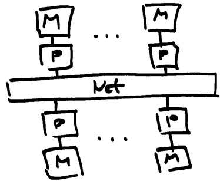
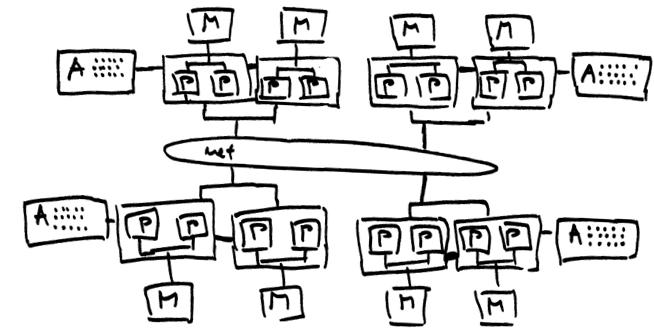
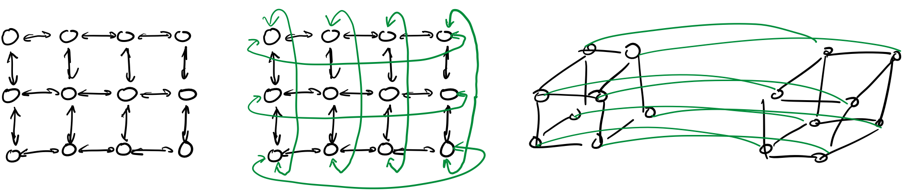
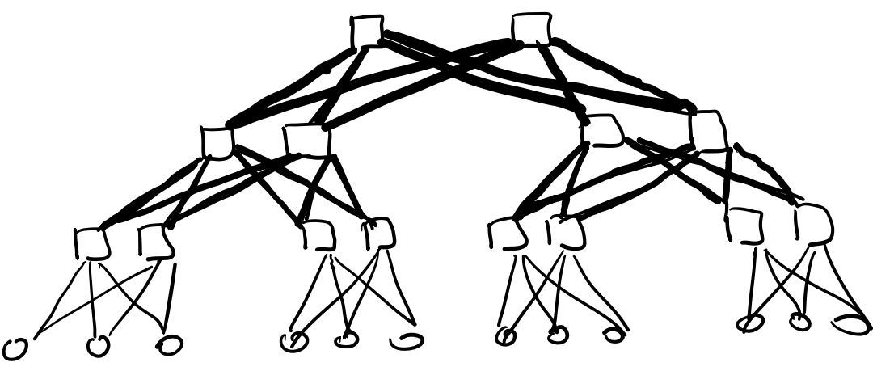
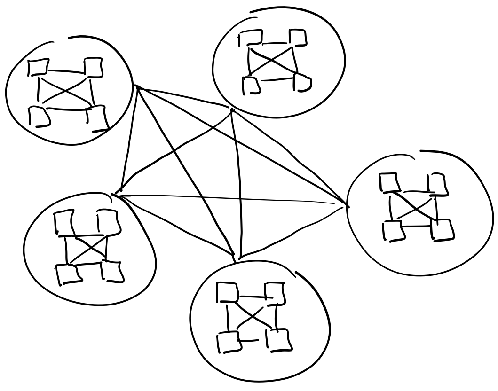
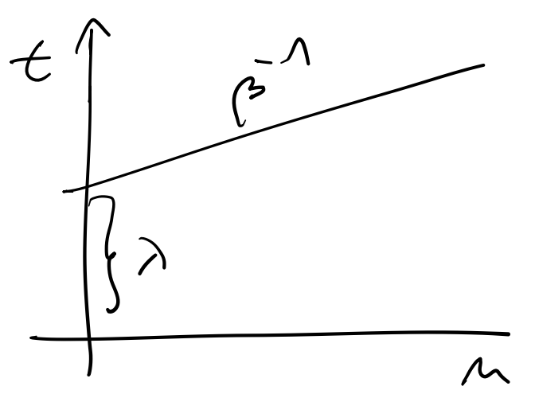

# Distributed memory systems

## Architecture

- multiple instructions, multiple data
- processors have their own memory
- other processors do not see memory changes
- processors exchange data by sending messages
- slower compared to the shared memory systems
- more scalable
- focus on interconnections
- off-the-shelf hardware components (cost effective)
- first systems had one core per node

  

- modern systems are heterogeneous
  - many nodes connected
  - shared memory within a node
  - offload systems on some nodes
  - message passing between nodes
  - programming of modern systems reflects architectural design

  

- network or interconnect is what distinguishes distributed systems
  - distributed memory parallel computers are just regular computers, nodes programmed like any other
  - designing and programming the distributed memory systems means thinking about how data moves between the compute nodes

## Interconnect

- important characteristics
  - How are the nodes connected?
  - How are the nodes attached to the network?
  - What is the performance of the network?
- direct and indirect topologies
  - each node has a switch in direct topologies
  - there are more switches than nodes in indirect topologies

### Direct topologies

- mesh and torus
  - 1D, 2D, 3D, xD
  - torus links mesh ends together
  - hypercube

  

- communication is efficient among neighboring nodes
- constant cost to scale to more nodes
- simple routing algorithms
- easy to understand, simple to model
- matches many problems well

### Indirect topologies

- multilevel networks
  - fat-tree network

    

  - dragonfly

    

- better throughput than direct topologies
  - reduced number of hops
- cost grows faster than linear with additional compute nodes
- more complex, harder to model

### Modelling throughput

- simple model
  - latency $\lambda$ (seconds) needed to establish a connection
  - bandwidth $\beta$ (bits per second)
  - time needed to transfer a message od length $n$ (bytes, byte equals eight bits):

    $t(n) = \lambda + \frac{1}{\beta} n$

    

- improvements
  - account for the number of hops
  - additional network characteristics
  - topology, number of simultaneous connections, ...
