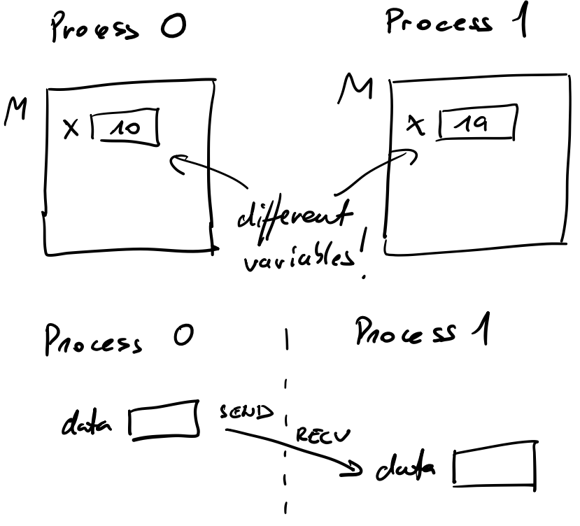
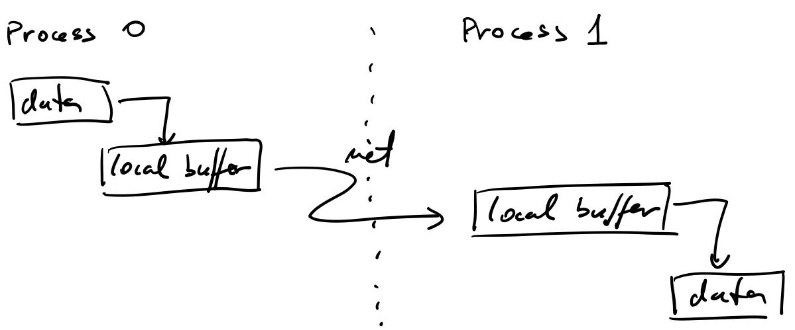
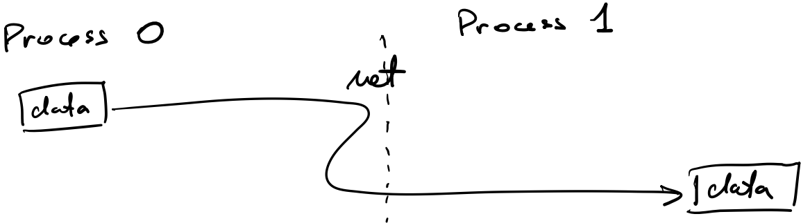

# MPI

- Message Passing Interface
- standard library interface specified by MPI forum
  - well recognized - each cluster has support for MPI
  - all operations include routine calls
- implements message passing model
  - data transfer
  - synchronization
- support
  - official support for C/C++, Fortran
  - available other bindings (Java, Python) but are not standard
- versions
  - MPI-1.2 (mostly sufficient)
  - MPI-2.1 (I/O, dynamic process management)
  - MPI-3 (enhanced collectives, multithreaded programming, performance tools)
  - implementations
    - MPICH
    - OpenMPI

## MPI Advantages

- recognized and standardized library
  - some implementations are free
- well understood
- tuned for all sorts of hardware
- used in many applications
- transferrable on code-level
- it supports many useful functions
- quite simple to use

## Programming Concepts

- usually, we prepare one parallel program, which consists of many parallel processes; differentiation is made inside the code
- each parallel process has its own address space
- data is sent explicitly among processes
  - a programmer manages data distribution
  - a programmer takes care of data transfers

  

- inter-process communication consists of
  - data transfers
    - point-to-point
    - collectives
  - synchronization

- process
  - processes reside in separate address spaces
  - many processes can run on a single core or a single node
  - process has its own
    - program code and program counter
    - stack and stack pointer
    - heap
    - static variables
    - may have one or multiple threads

- communicator
  - processes are collected into groups
  - each message is sent in a context and must be received in the same context
  - a group and a context form a communicator
    - default communicator ```MPI_COMM_WORLD``` contains all processes
    - a process inside a communicator is identified by its rank
    - a rank is a number in the interval [0, P-1], where P is the number of processes

- message
  - a message consists of
    - communicator
    - source address
    - destination address
    - tag
    - data
  - a message is accompanied by a user-defined integer tag to assist the receiving process in identifying the message
    - communicator, source, destination, and tag must match
    - ```MPI_ANY_TAG``` does not care about the tag in a receiving message
    - ```MPI_ANY_SOURCE``` does not care about the source of a receiving message
  - data in a message is described with MPI data types
    - compatibility
    - it is not necessary that sending and receiving datatype match

## Environment

- each process must see executable and data
  - cluster middleware (SLURM) and network file system
  - processes must have permission to run over a network
- on Arnes cluster use module ```OpenMPI```
- executable ```mpirun``` (```mpiexec````) starts the requested number of processes
- a common approach is to use one executable on all nodes, differentiation is made inside the code

- in C/C++ we must include library ```mpi.h```
- we compile with ```mpicc```
- each function returns an error code or ```MPI_SUCCESS```
- by default, an error causes all processes to abort

## MPI Programming Basics

- Initialization
  - ```MPI_Init(&argc, &argv)```
    - ```MPI_Init_thread``` is recommended with MPI-2
      - ```MPI_THREAD_SINGLE``` has the same behavior as ```MPI_Init```
      - additional arguments that take care of thread safety needed to use OpenMP with MPI
    - it must be the first MPI routine in a program
- Finalization
  - ```MPI_Finalize()```
  - it must be the last MPI routine in a program
- communicator enquiry
  - number of processes in communicator: ```MPI_Comm_size(MPI_COMM_WORLD, &size)```
  - rank of the process: ```MPI_Comm_rank(MPI_COMM_WORLD, &myid)```
- timing
  - wall-clock time in seconds: ```MPI_Wtime()```
  - difference between two points in time is only relevant
  - timer resolution: ```MPI_Wtick()```

## MPI Programming: Point-to-point Communication

- approaches
  - cooperative
    - data is explicitly sent by one process and received by another
    - any change in the receiver’s memory is made with his participation
    - communication and synchronization are combined
    - ```MPI_Send/MPI_Recv```
    - commonly used
  - one-sided
    - only one process takes care of data transfer
    - remote memory reads and writes
    - communication and synchronization are decoupled
    - ```MPI_Put/MPI_Get```
    - rarely used
  - we will focus on cooperative approach

### Blocking Communication

- data transfer
  - ```MPI_Send``` copies data to local buffer sending process continues executing
  - ```MPI_Recv``` of the receiving process gets data when data is ready
    - blocks program execution until data is ready
    - details about the received message can be obtained from the returned status (```MPI_Status```)

- buffer mode
  - dead-lock prevention
  - smoother operation
  - buffer mode sending can be explicitly specified with ```MPI_Bsend```
  - buffer is of limited size; if a message is larger than the buffer, synchronous (buffer-less) mode is used
  
  

- synchronous (buffer-less)
  - it is better to avoid copying to buffer
  - sending process and receiving process must synchronously exchange data - sending process is blocked until receiving process is not ready
  - synchronous sending can be explicitly specified with ```MPI_Ssend```

  

- coding explicit transfers of data

  - approach 1:

    ```C
    Process 0                       Process 1
      MPI_Send() to Process 1         MPI_Send() to Process 0
      MPI_Recv() from Process 1       MPI_Recv() from Process 0
    ```

    - works in buffered mode
    - fails in synchronous mode
    - unsafe as it depends on the buffer size

  - approach 2

    ```C
    Process 0                       Process 1
      MPI_Send() to Process 1         MPI_Recv() from Process 0
      MPI_Recv() from Process 1       MPI_Send() to Process 0
    ```

    - each send has corresponding receive
    - works in both modes

- example: [hello.c](files/hello/hello.c), [hello.sh](files/hello/hello.sh)
  - compiling on the Arnes cluster
    - ```module load OpenMPI````
    - ```mpicc -o hello hello.c```
  - running
    - ```sbatch hello.sh```

- examples:
  - [p2p.sh](files/p2p/p2p.sh): SLURM script for running examples
  - [p2p1.c](files/p2p/p2p1.c): blocking communication, approach 1
  - [p2p2.c](files/p2p/p2p2.c): blocking communication, approach 2
  - [p2p5.c](files/p2p/p2p5.c): blocking communication, send and receive combined in one function

### Immediate or Non-blocking Communication

- immediate function calls
  - function returns immediately, send is performed by another thread
  - on return function gives handler for testing on completion
- it is safe to use
  - not necessarily faster
  - lots of short messages, lots of handlers
- not necessarily concurrent/asynchronous
  - depends on MPI implementation
- function set
  - request:
    - ```MPI_Request```
  - send/receive (one of arguments is request)
    - ```MPI_Isend```, ```MPI_Irecv```, ```MPI_Ibsend```, ```MPI_Issend```
  - inquiry about request
    - ```MPI_Wait```, ```MPI_Test```
- blocking and immediate functions can be combined

- examples:
  - [p2p.sh](files/p2p/p2p.sh): SLURM script for running examples
  - [p2p3.c](files/p2p/p2p3.c): immediate communication with ```MPI_Wait```
  - [p2p4.c](files/p2p/p2p4.c): immediate communication with ```MPI_Test```

### Example: The Conway's Game of Life

- MPI implementation of the Conway's gamne of life
- the board is split to horizontal stripes
- cells on borders are exchanged via ```MPI_Sendrecv```
- code:
  - [conway.c](files/conway/conway.c)
  - [board.h](files/conway/board.h)
  - [conway.sh](files/conway/conway.sh)
