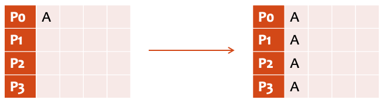
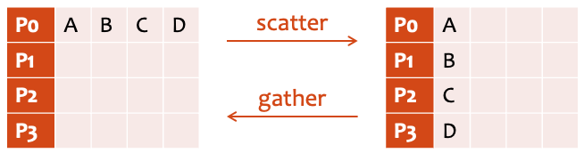
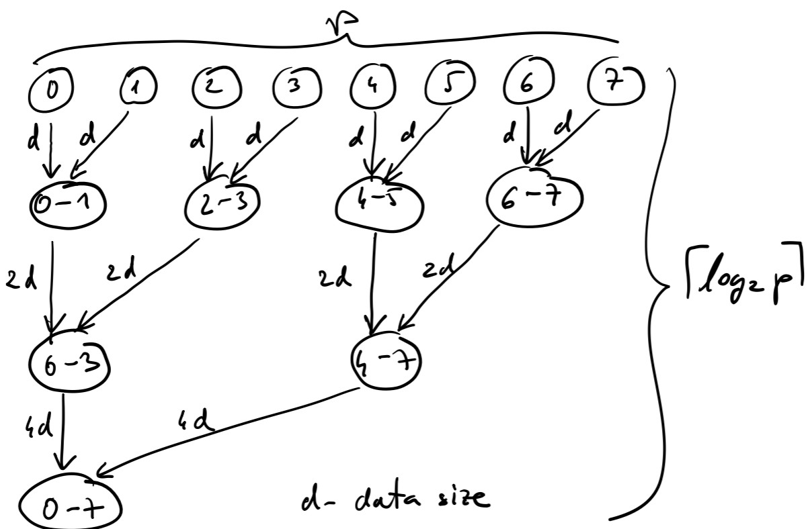
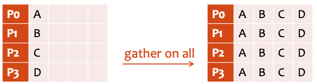
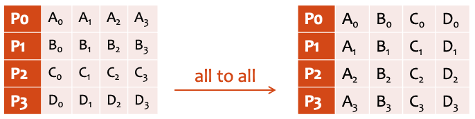
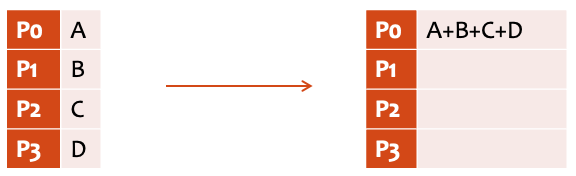
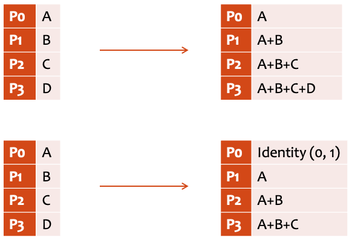
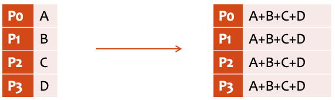
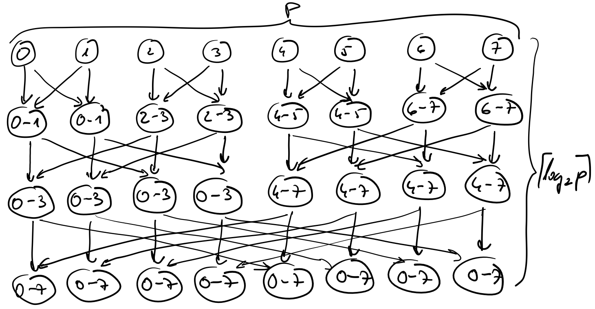

# MPI - Collective Communication and Computation

- involves all processes in communicator
  - ```MPI_COMM_WORLD``` is default
  - can create own subsets
  - MPI-2+ can create even bigger sets if dynamic process allocation is supported
- programs using only collective communication are easy to understand
  - every process does roughly the same thing
  - no inventive communication patterns
- functions for collective communication are optimized
  - devised by experts
  - detailed implementation depends on infrastructure
    - existing protocols in network infrastructure (broadcast)
- all collective functions must be called by all processes in the communicator
- functions work with any number of processes from 1 onwards
- all collective functions are blocking (MPI-1, MPI-2)
- there are no tags
- basic data types (MPI-1, MPI-2)
- types of collectives
  - synchronization
  - data transfer
  - collective computation
  
## Synchronization

- ```MPI_Barrier```
  - rarely used
  - for performance measurements

## Data Transfer

- ```MPI_Bcast```
  - one to all (broadcast)

    

- ```MPI_Scatter```and ```MPI_Gather```
  - scatters or gathers data across processes in the same communicator

    

  - expect all data chunks to be of the same size
  - root process takes care of one data chunk
  - some parameters are valid on side of sender, some on side of receiver
  - tree-like implementation of gather

    

- ```MPI_Scatterv``` and ```MPI_Scatterv```
  - more general but slower functions
  - size of data chunk can vary

- ```MPI_Allgather```
  - combines gather and broadcast
  - can be efficiently implemented by only one pass of the tree

    

- ```MPI_Alltoall```
  - transpose of data
  - tricky to implement efficiently
  
    

- example: The Conway's Game of Life
  - the board is split to horizontal stripes
  - cells on borders are exchanged via ```MPI_Sendrecv```
  - code:
    - [conway.c](files/conway/conway.c)
    - [board.h](files/conway/board.h)
    - [conway.sh](files/conway/conway.sh)

## Collective computation

- ```MPI_Reduce```
  - reduces data from several processes
  - reduce operations
    - extreme: ```MPI_MIN```, ```MPI_MAX```
    - sum and product: ```MPI_SUM```, ```MPI_PROD```
    - logical operations: ```MPI_LAND```, ```MPI_LOR```, ```MPI_LXOR```
    - bit-wise operations: ```MPI_BAND```, ```MPI_BOR```, ```MPI_BXOR```
    - extreme with location: ```MPI_MAXLOC```, ```MPI_MINLOC```

    


- ```MPI_Scan``` and ```MPI_Exscan```

    

- ```MPI_Allreduce```
  - combination of reduce and broadcast

    

  - can be implemented with one pass of a tree

    

- determinism
  - rounding error, truncation, depends on order of computation
  - MPI does not guarantee the same result on the same input
    - encouraged but not required
    - not all applications need it
    - more efficient implementations of collectives are possible without it

- example: reduce with location information
  - combined data type
  - code:
    - [maxloc.c](files/maxloc/maxloc.c)
    - [maxloc.sh](files/maxloc/maxloc.sh)

## Advanced MPI Features

- data types
- communicators
- virtual topology
  - reflects actual system configuration
  - Cartesian, graph
- MPI-IO
- collective functions
  - neighborhood
  - immediate
